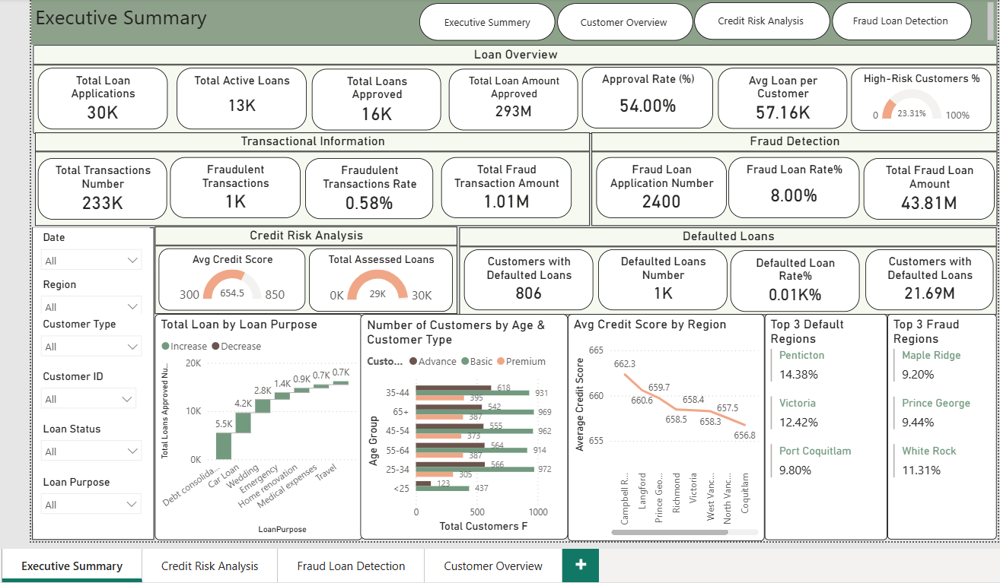
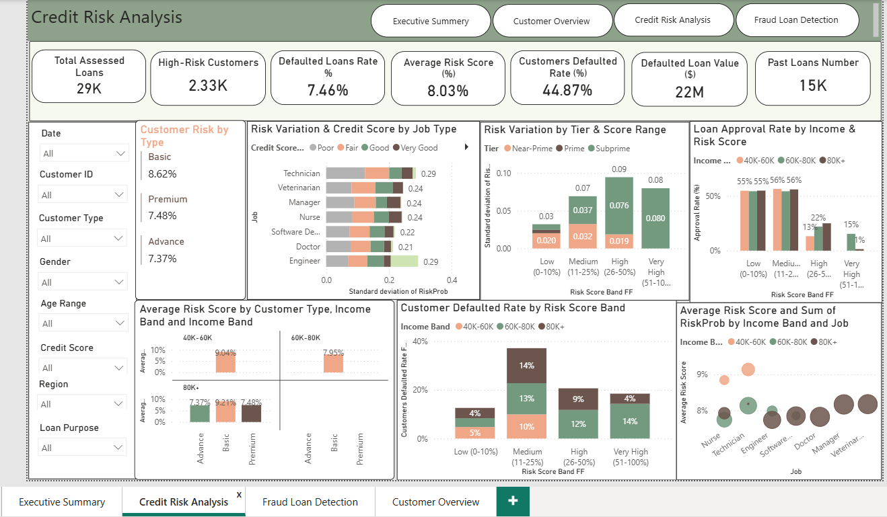
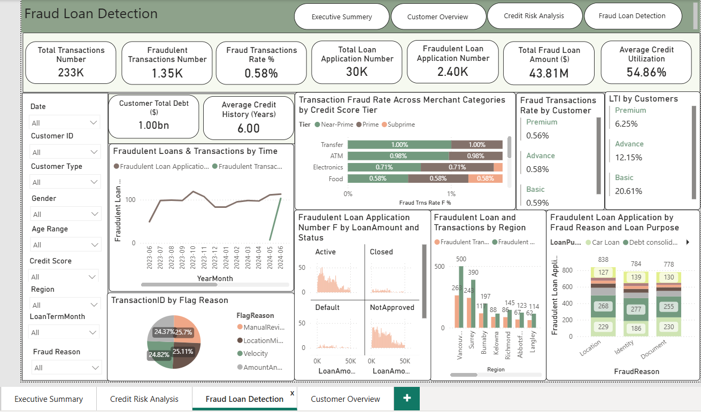
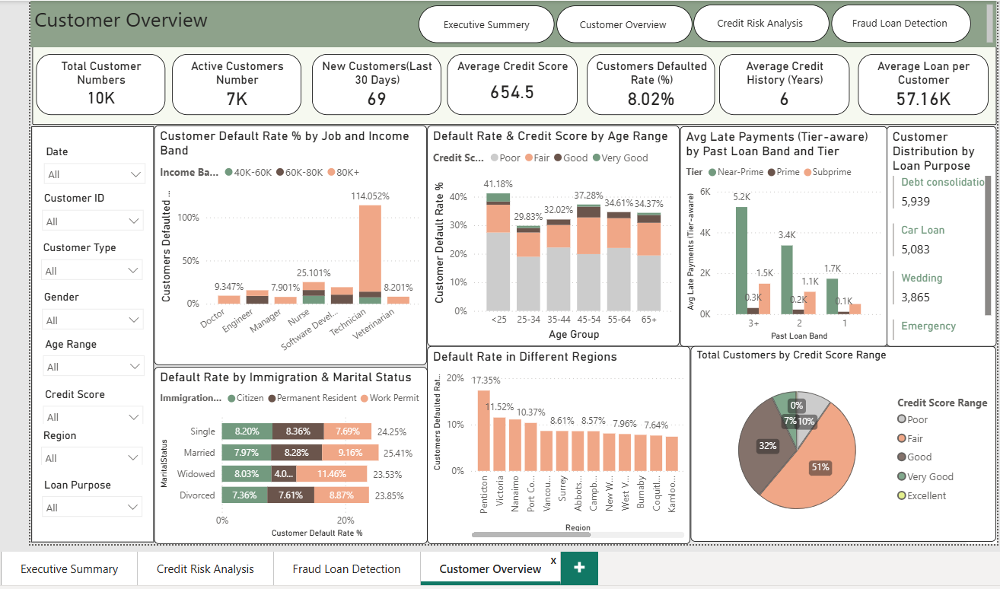

# Credit Risk Analytics & Fraud Detection

## Project Overview

This end-to-end business analytics project was designed to support executive-level decision-making in credit risk monitoring, fraud detection, customer analytics, and portfolio performance management.

The solution integrates Power BI, SQL, and DAX to transform raw financial and transactional data into interactive business intelligence dashboards focused on operational and strategic risk analysis.

---

## Business Objectives

- Monitor loan portfolio performance
- Identify high-risk customer segments
- Detect fraudulent transactions and applications
- Analyze default trends across regions and customer groups
- Improve executive visibility into portfolio risk exposure
- Support KPI-driven financial decision-making

---

## Dashboard Pages

### Executive Summary
Provides a high-level overview of:
- Total loan applications
- Approval rate
- Loan portfolio value
- Fraud exposure
- Default trends
- Credit risk KPIs

### Credit Risk Analysis
Focused on:
- High-risk customer identification
- Risk score segmentation
- Default rate analysis
- Credit score monitoring
- Loan approval behavior by risk tier

### Fraud Detection
Focused on:
- Fraud transaction monitoring
- Fraudulent loan applications
- Fraud trends over time
- Fraud exposure by region
- Merchant category fraud analysis

### Customer Overview
Focused on:
- Customer segmentation
- Credit score distribution
- Customer default behavior
- Income and demographic analysis
- Portfolio customer trends

---

## Tools & Technologies

- Power BI
- DAX
- SQL
- Data Modeling
- Power Query
- Excel

---

## Repository Structure

- `screenshots/` — Dashboard page previews
- `sql/` — Data cleaning, validation, and schema checks
- `dax/` — Power BI DAX measures used for KPI calculations

---

## Key Features

- Interactive executive dashboards
- Star schema data modeling
- KPI-driven reporting framework
- Fraud and credit risk analytics
- Dynamic filtering and drill-down analysis
- DAX-based financial calculations
- Business-focused storytelling visuals

---

## Screenshots

### Executive Summary

### Credit Risk Analysis

### Fraud Detection

### Customer Overview

